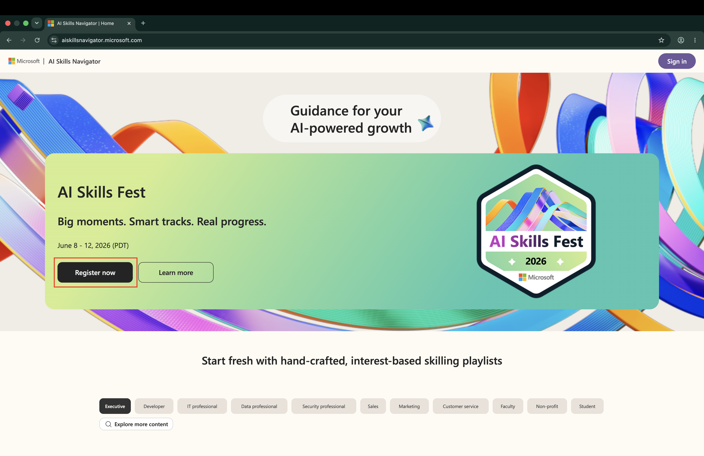
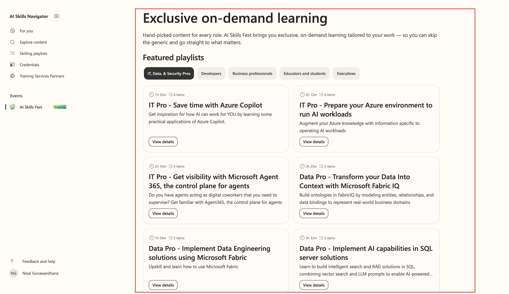
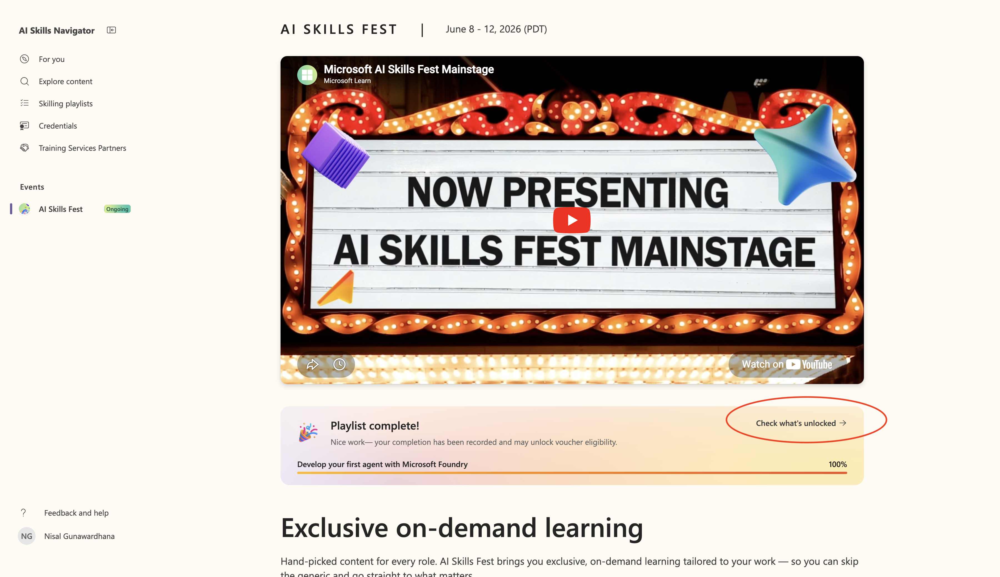
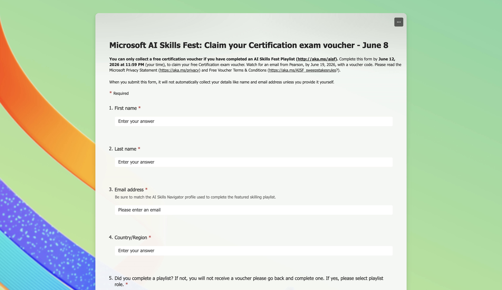

# Microsoft AI Skills Fest 2026 – Free Certification Voucher Offer

> Official Rules, Terms and Conditions

Complete one eligible Microsoft AI Skills Fest skilling playlist on AI Skills Navigator during the Active Period to earn a **free Microsoft Certification exam voucher** and a **digital badge**.

## 🗓️ Active Period

| Event | Date & Time (UTC) |
|-------|-------------------|
| **Starts** | June 8, 2026, 7:00 AM (00:00) UTC |
| **Ends** | June 12, 2026, 11:59 PM (23:59) UTC |

## ✅ Quick Summary

| Item | Detail |
|------|--------|
| What you do | Complete one eligible, unmodified AI Skills Fest skilling playlist |
| Where | AI Skills Navigator |
| Reward | 1 free certification exam voucher + 1 digital badge |
| Voucher claim | Manual — submit a form with your info (not automatic) |
| Badge delivery | Via email from Credly by June 19, 2026 |
| Voucher redemption deadline | Within 60 days of issuance, by 12:00 AM UTC, August 11, 2026 |
| Limit | One reward per person |

## 1. Eligibility

To enter, you must:

- Have reached the **age of majority** in your province, territory, or country of residence at the time of entry. If you have not, you must obtain consent from a parent or legal guardian.
- Have a **registered and active AI Skills Navigator account**.

**Void in:** Cuba, Iran, North Korea, Sudan, Syria, the Region of Crimea, Russia, and where prohibited by law.

> ⚠️ The completed AI Skills Fest skilling playlist **cannot be edited or modified** to be eligible for receipt of completion rewards.

## 2. Challenge Details

- To participate, you must **register on AI Skills Navigator** and acknowledge that you have read and agree to the Official Rules.
- To qualify for the voucher, participants must complete **one unmodified, eligible Microsoft AI Skills Fest skilling playlist in its entirety** on AI Skills Navigator during the Active Period.

## 3. Rewards

Participants who complete an eligible skilling playlist during the Active Period will earn:

| # | Reward |
|---|--------|
| a | One (1) free Microsoft Certification exam voucher |
| b | One (1) digital badge recognizing completion of a Microsoft AI Skills Fest skilling playlist |

**Important details:**

- The digital badge will be distributed via email from **Credly by June 19**.
- To receive the voucher by email, participants must **complete the form with their information**. The voucher will **not** be triggered automatically.
- Voucher terms, expiration dates, and eligible exams will be specified at the time of distribution.
- The certification exam voucher must be **redeemed within 60 days of issuance**, by **12:00 AM UTC, August 11, 2026**.
- **Limit one reward per person**, regardless of the number of skilling playlists completed.

## 4. General Terms and Conditions

- To the extent permitted by law, by participating in AI Skills Fest, you agree to **release and hold harmless** Microsoft and its respective parents, partners, subsidiaries, affiliates, employees, and agents from any and all liability, injury, loss, or damage of any kind arising from or in connection with participation in AI Skills Fest or receipt or use of any reward.
- **All decisions regarding eligibility, completion, and rewards are final and binding.**
- Microsoft reserves the right to **cancel, modify, suspend, or terminate** AI Skills Fest for any reason, including but not limited to fraud, cheating, technical failures, or any other factor that compromises the integrity or proper functioning of AI Skills Fest.
- Personal data collected during AI Skills Fest will be used by Microsoft **solely for the administration and operation** of AI Skills Fest and in accordance with the Microsoft Privacy Statement.

## ❓ Questions or Support

For questions related to Microsoft AI Skills Fest, refer to the **AI Skills Navigator support resources**.

## 🚀 How to Claim Your Free Voucher (Step-by-Step Guide)

### Step 1 — Register on AI Skills Fest before June 12

Go to [AI Skills Navigator](https://shorturl.at/EbE8G) and create or sign in to your account. Accept the Official Rules to register for AI Skills Fest.

---

### Step 2 — Find an eligible skilling playlist

Browse the AI Skills Fest playlists on AI Skills Navigator and pick one that interests you. Make sure it is marked as an eligible AI Skills Fest playlist.

---

### Step 3 — Complete the entire playlist

Work through every module in the playlist without modifying or skipping anything. Once you finish, you will see a confirmation message:

> **"Nice work — your completion has been recorded and may unlock voucher eligibility."**

---

### Step 4 — Check what's unlocked and fill out the claim form

After completing the playlist, click the link below to open the voucher claim page. Fill out the form with your details — the voucher is **not** sent automatically.

Once submitted, watch your inbox for the voucher email. Your Credly digital badge will also arrive by **June 19, 2026**.

---

## 📝 Step-by-Step Checklist

1. Confirm you meet the age-of-majority requirement (or have guardian consent).
2. Register and activate an AI Skills Navigator account.
3. Acknowledge and agree to the Official Rules.
4. Choose an eligible AI Skills Fest skilling playlist.
5. Complete the entire playlist between June 8–12, 2026 (UTC) — do not edit/modify it.
6. Submit the form with your information to trigger the voucher.
7. Watch for the Credly badge email by June 19, 2026.
8. Redeem the voucher before 12:00 AM UTC, August 11, 2026.

---

*This document reproduces the Official Rules, Terms and Conditions of the Microsoft AI Skills Fest Free Certification Voucher Offer. Always verify on official Microsoft sources before participating.*
